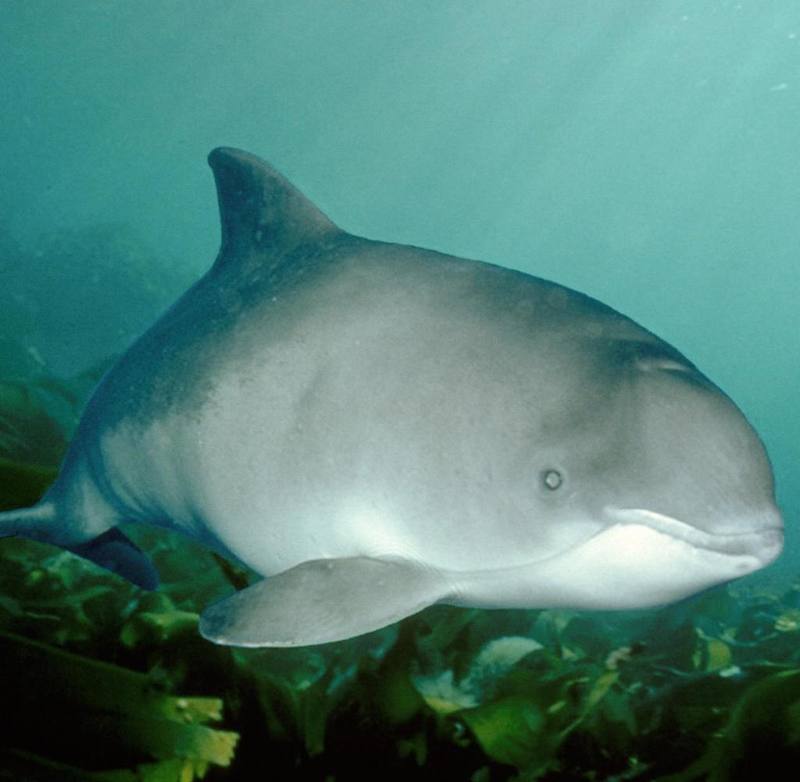
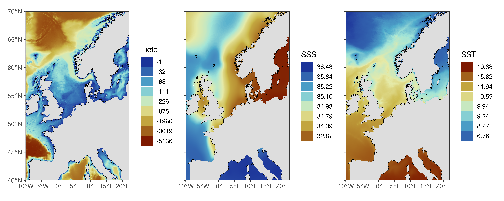
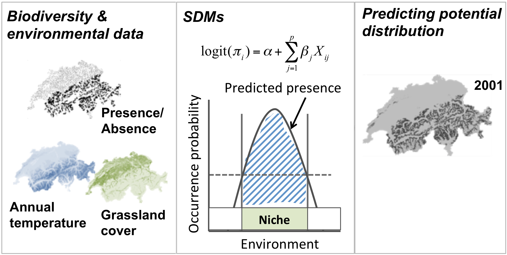
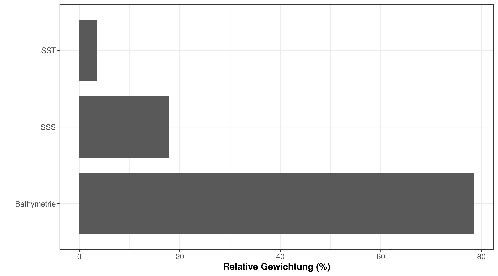
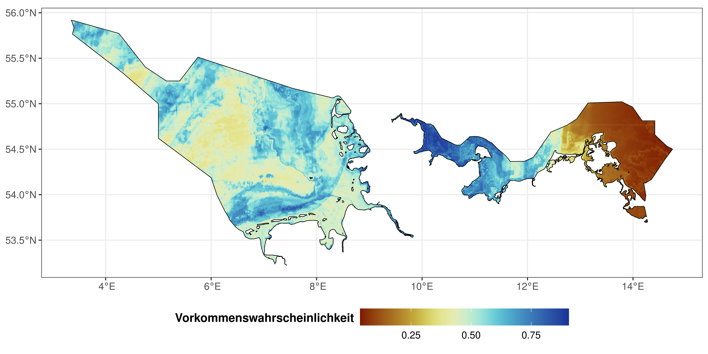
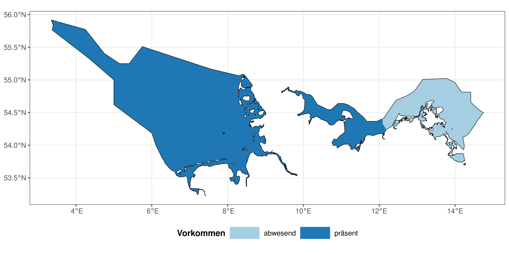

Welche Faktoren beeinflussen die Schweinswal-Verbreitung in der AWZ der
Nord- und Ostsee?
================

<!--
output: 
  word_document
-->

# AWZ Nord- und Ostsee

-   ist geprägt durch Interessenskonflikt zwischen:

**Nutzung:**

1.  Schifffahrt

2.  Offshore-Windparks

3.  Netzanbindung

4.  Rohstoffgewinnung und Infrastruktur

**Naturschutz:**

1.  Biotopschutz <!-- ... -->

2.  Gebietsschutz <!--(6 Naturschutzgebiete)-->

3.  **Besonderer Artenschutz**
    <!--(Schweinswal, Seehund und Kegelrobbe)-->

4.  Eingriffsregelung <!-- ... -->

------------------------------------------------------------------------

# Besonderer Artenschutz bei Eingriffen

-   Tötungsverbot
-   Störungsverbot
-   Verbot der Beschädigung von Fortpflanzungs- und Ruhestätten

=&gt; Bedarf nach Wissen über das natürliche Verbreitungsgebiet und die
Habitatspräferenzen der besonders schützenswerten Arten

------------------------------------------------------------------------

# Methodik: Verbreitungsmodelle

------------------------------------------------------------------------

# Methodik: Verbreitungsdaten

Ocean Biodiversity Information System (obis.org)

<!--  -->

------------------------------------------------------------------------

# Methodik: Umweltdaten

MARSPEC (Sbrocco & Barber, 2013; marspec.org)

------------------------------------------------------------------------

# Methodik: Verbreitungsmodelle

------------------------------------------------------------------------

# Methodik: Verbreitungsmodelle

------------------------------------------------------------------------

# Resultate: bedeutende Faktoren

------------------------------------------------------------------------

# Resultate: Reaktionsverlauf

------------------------------------------------------------------------

# Resultate: Artverbreitung

------------------------------------------------------------------------

# Resultate: Artverbreitung AWZ

------------------------------------------------------------------------

# Resultate: Artverbreitung AWZ

------------------------------------------------------------------------

# Diskussion

-   Tiefe ist wichtigste erklärende Variable?
-   Berücksichtigung von anthropogenen Störungen fehlt
-   Modelle sind immer nur so gut wie die zugrundliegenden Daten
-   Alternative Methoden: Occupancy Modelle, Resource Selection
    Functions, Richness Modelle
-   **Alle Modelle sind falsch, aber einige sind nützlich!**

------------------------------------------------------------------------
