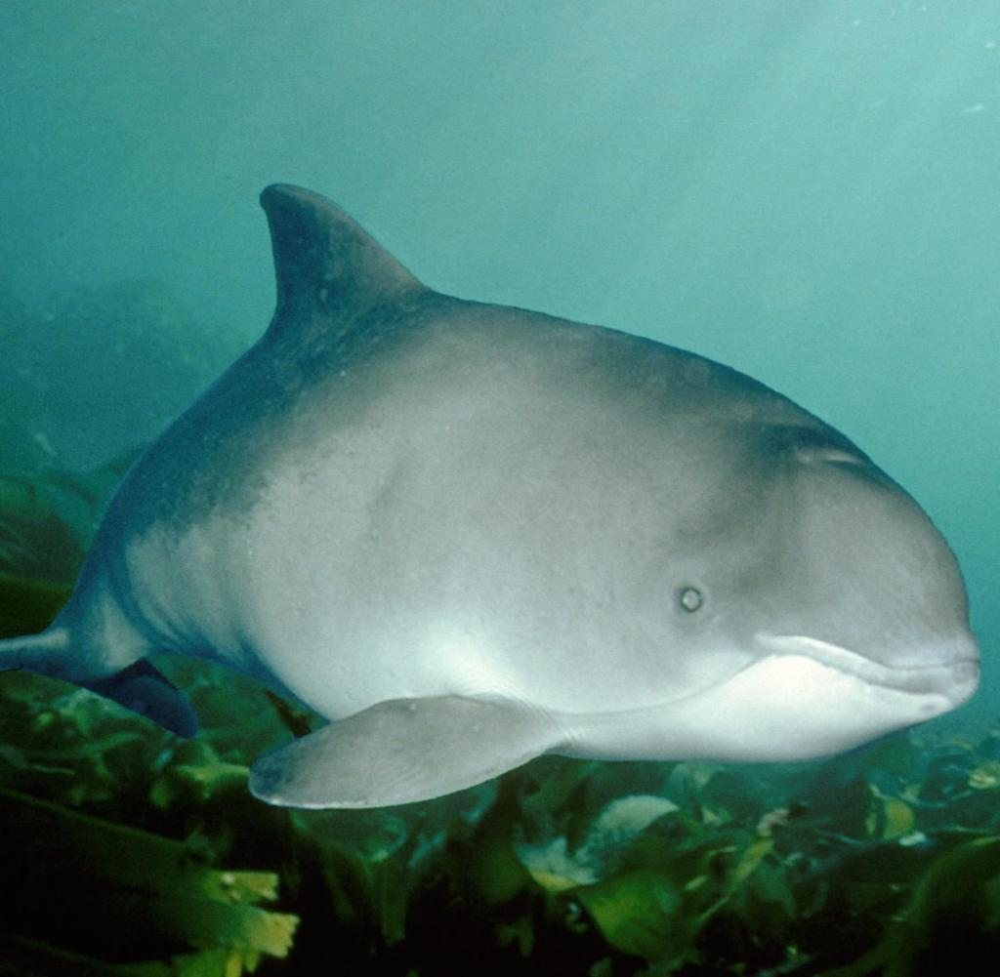
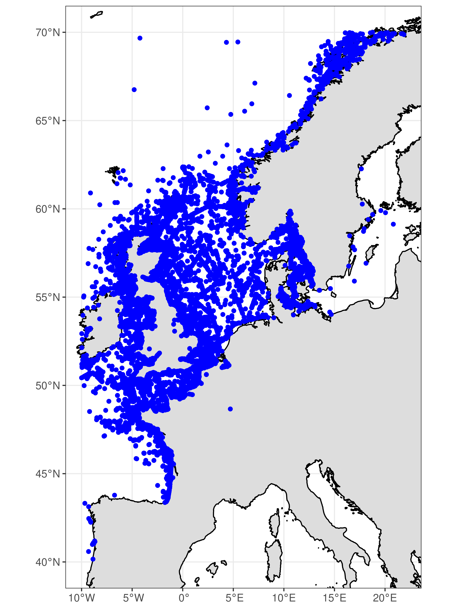
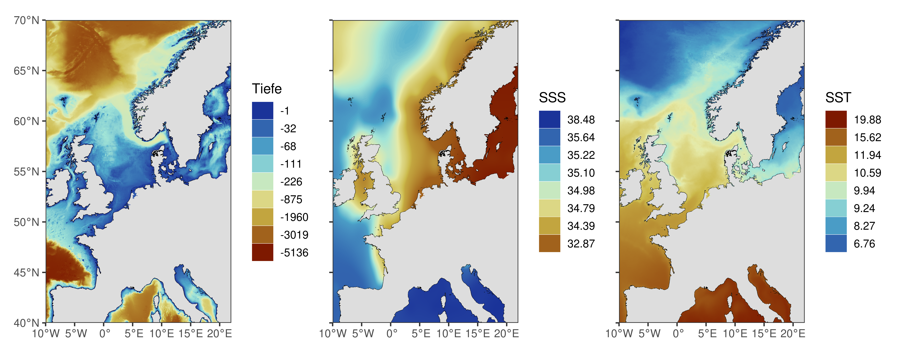
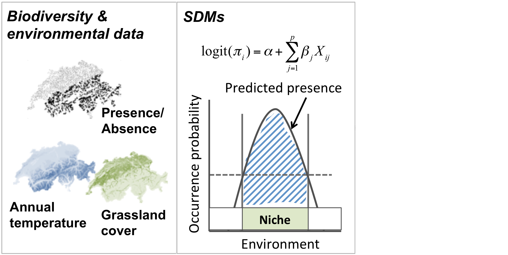
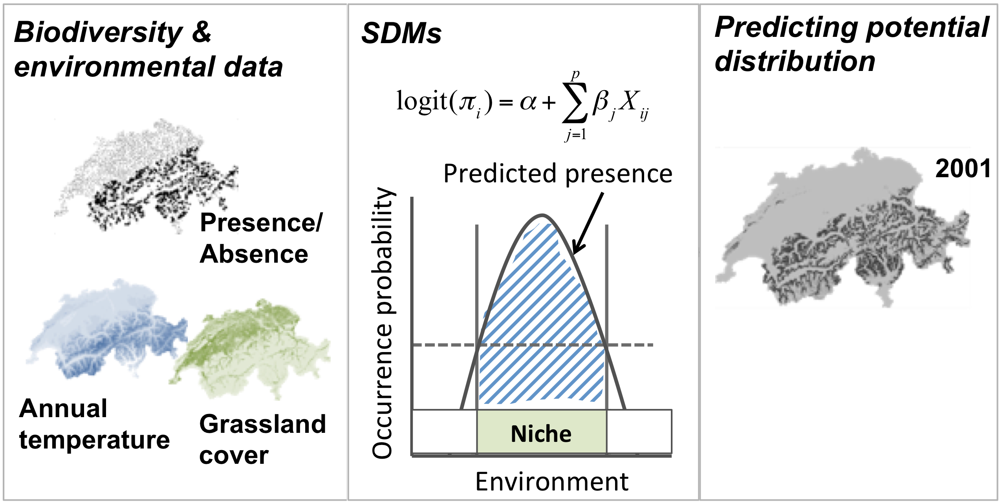
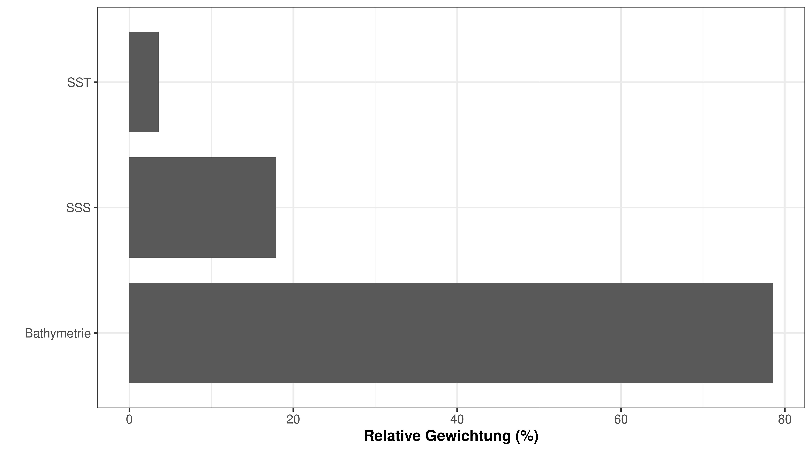
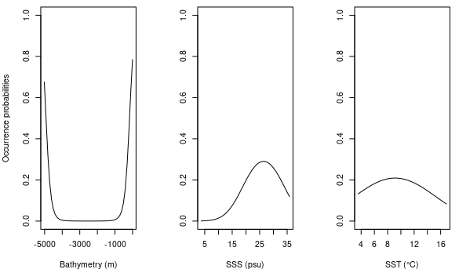
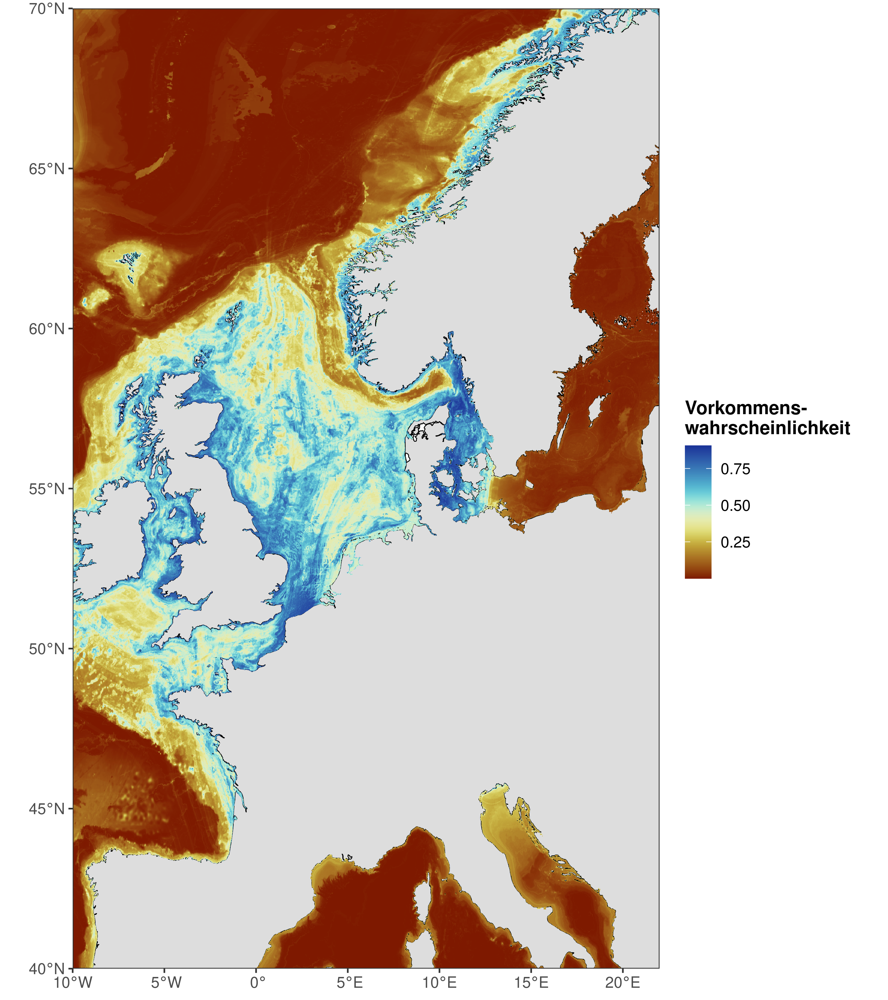
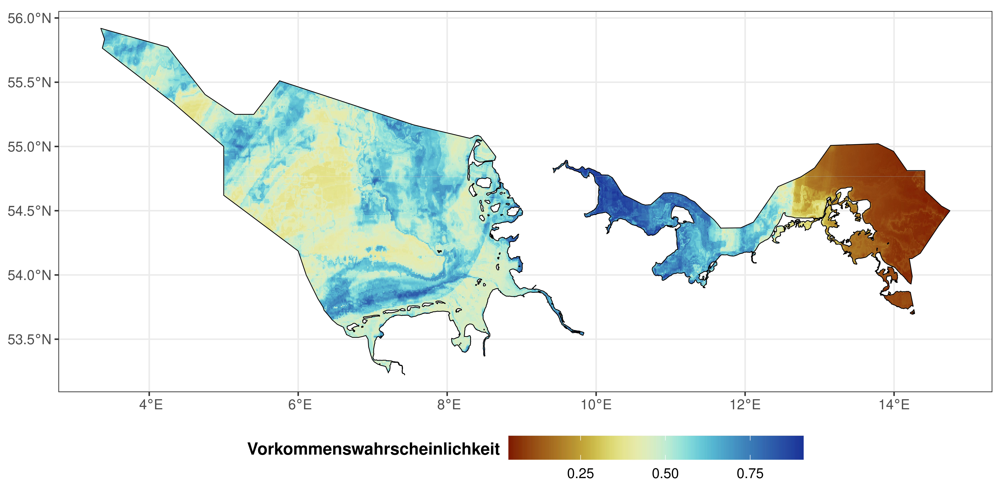
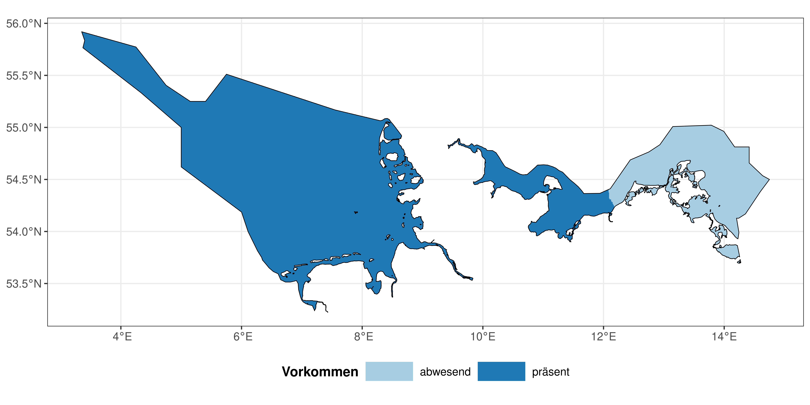

class: my-one-page-font

```{css, echo=F}
.my-one-page-font {
  font-size: 30px;
}
```

```{r setup, include=FALSE}
options(htmltools.dir.version = FALSE)
```

```{r xaringan-themer, include=FALSE, warning=FALSE}
library(xaringanthemer)
style_duo_accent(
  primary_color = "#1381B0",
  secondary_color = "#FF961C",
  inverse_header_color = "#FFFFFF",
  extra_css = list(
    ".has-continuation" = list(
      "display" = "block !important"
    )
  )
)
```


# AWZ Nord- und Ostsee

- ist geprägt durch Interessenskonflikt zwischen:

--

.pull-left[
**Nutzung:**

1. Schifffahrt

1. Offshore-Windparks

1. Netzanbindung

1. Rohstoffgewinnung und Infrastruktur
]

--

.pull-right[
**Naturschutz:**

1. Biotopschutz <!-- ... -->

1. Gebietsschutz <!--(6 Naturschutzgebiete)-->

1. **Besonderer Artenschutz** <!--(Schweinswal, Seehund und Kegelrobbe)-->

1. Eingriffsregelung <!-- ... -->

]

---

class: my-one-page-font

# Besonderer Artenschutz bei Eingriffen

- Tötungsverbot
- Störungsverbot
- Verbot der Beschädigung von Fortpflanzungs- und Ruhestätten

--

=> Bedarf nach Wissen über das natürliche Verbreitungsgebiet und die Habitatspräferenzen der besonders schützenswerten Arten

---

class: my-one-page-font

# Methodik: Verbreitungsmodelle


---

class: my-one-page-font

# Methodik: Verbreitungsdaten

Ocean Biodiversity Information System (obis.org)

.pull-left[

]

.pull-right[

]

---

class: my-one-page-font

# Methodik: Umweltdaten

MARSPEC (Sbrocco & Barber, 2013; marspec.org)



---

class: my-one-page-font

# Methodik: Verbreitungsmodelle



---

class: my-one-page-font

# Methodik: Verbreitungsmodelle



---
class: my-one-page-font

# Resultate: bedeutende Faktoren



---
class: my-one-page-font

# Resultate: Reaktionsverlauf



---
class: my-one-page-font

# Resultate: Artverbreitung



---
class: my-one-page-font

# Resultate: Artverbreitung AWZ



---
class: my-one-page-font

# Resultate: Artverbreitung AWZ



---

class: my-one-page-font

# Diskussion

--

- Tiefe ist wichtigste erklärende Variable?

--

- Berücksichtigung von anthropogenen Störungen fehlt

--

- Modelle sind immer nur so gut wie die zugrundliegenden Daten

--

- Alternative Methoden: Occupancy Modelle, Resource Selection Functions, Richness Modelle

--

- **Alle Modelle sind falsch, aber einige sind nützlich!**

---

class: my-one-page-font, inverse, center, middle

# Vielen Dank für Ihre Aufmerksamtkeit!
